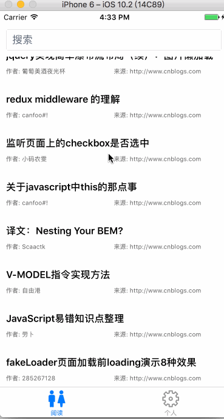

# tech_read/技术阅读器-mainly focus on front-end
a tool app for coder to read


<h3>1.项目的初衷</h3>

定期获取选的前端精选博客文章爬取并集中在一起，提开发爱好者阅读和搜索.

<h3>2.项目的目标</h3>
2.1 搭建后台管理系统，使页面爬取可配置.

2.1 react-native开发 ios版本.包括文章阅读，文章搜索，文章收藏，评论，点赞等功能.

<h3>3.现阶段进度</h3>
3.1 暂时没有后台管理系统，只提供爬取文章的工具类.

3.1 RN端实现 用户注册，登陆，文章阅读，文章搜索.界面暂时比较简单，包括部分界面路由没处理好，有时间会一个个fix掉.

<h3>4.开发环境</h3>
4.1 后端用express搭建服务器

4.2 数据库用mongodb

4.3 react-native安装参考 http://reactnative.cn/docs/0.38/getting-started.html

<h3>5.服务启动</h3>
5.1 启动 MongoDB

```
mongod --config /usr/local/etc/mongod.conf
```
5.3. 安装相关架包

```
 cd service
 npm i
```

5.2 运行爬虫工具 tech_read.js

```
service
----util
--------crawler
------------tech_read
----------------tech_read.js
```

5.3 启动express服务

```
sudo npm run dev
```
5.4 运行react-native

```
cd tech_read
npm i
react-native run-ios
```



